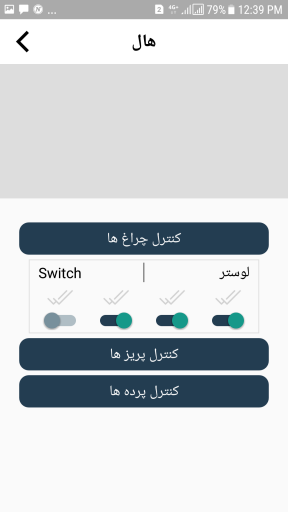
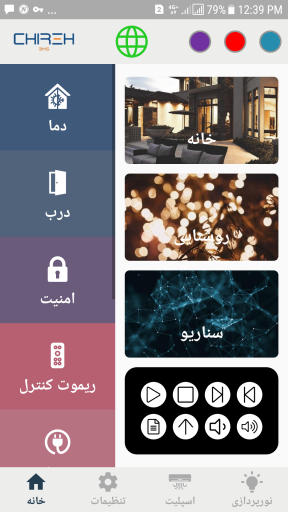
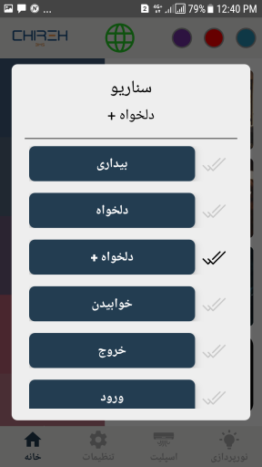
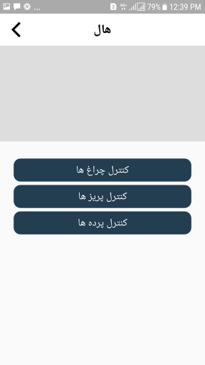

# 🏠 Chira BMS - Smart Home Control System

## 📌 Introduction

Chira BMS is an advanced **IoT-based smart home automation** system that allows users to **remotely control** and **manage household appliances** via a cloud-based and local network system. Whether you're inside your home using **WiFi** or away with an **internet connection**, Chira BMS ensures that you always stay in control. 

If you've ever left home and realized you forgot to turn off the lights, lock the doors, or switch off electrical devices, **Chira BMS** is your perfect solution. 🚀

## 🌍 Availability in Iran

Yes! **Chira BMS** is designed to be fully functional within Iran. This **locally developed** system is equipped with specialized **hardware modules** and operates through **UDP and TCP socket communication** over **Router & Cloud Server** protocols. 

## ⚙️ Features

Chira BMS provides a seamless **smart home** experience with the following features:

- 🔑 **Lock & unlock doors remotely**
- 🚪 **Open & close doors**
- 💡 **Turn lights on & off**
- 📺 **Control home entertainment systems**
- 🔐 **Secure data transmission with multi-layer encryption**
- 📲 **Real-time command delivery tracking**

## 🏗️ Technology Stack
- **Client-Side (iOS App)**: Developed in **Swift** 🍏
- **Hardware Integration**: Direct connection with **IoT devices & hardware modules**
- **Backend Communication**: Uses **UDP & TCP sockets**
- **Network Support**: Works over **WiFi (Local Network) & Cloud Server**

## 🌍 How It Works

- 📶 When at home: Devices connect via **WiFi** for seamless local communication.
- 🌐 When away: The app connects to the **Cloud Server** for remote access.

## 📥 Download the iOS App
👉 [Download from SibApp](https://sibapp.com/applications/%D8%AE%D8%A7%D9%86%D9%87-%D9%87%D9%88%D8%B4%D9%85%D9%86%D8%AF-%DA%86%DB%8C%D8%B1%D9%87)

## 📸 Screenshots

## 🎥 Video Demo

---

💡 **Stay tuned for updates!** 🚀